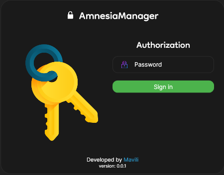
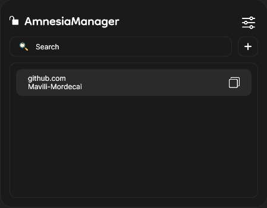
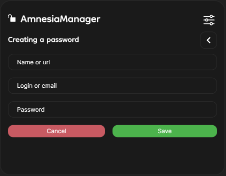

# Amnesia Manager

A password manager with local storage and AES-256 encryption, built with C# (WPF).
This application allows you to securely store passwords, protected by a master password using AES-256 encryption.

## Requirements
- **.NET 9** (Required to run)
  Download it [here](https://dotnet.microsoft.com/download/dotnet/9.0).

## Features
- 🔒 **Local storage** (password data never leaves your computer).
- 🔑 **AES-256 encryption** using a master password.
- ⚡ **Quick access** via hotkey (`Ctrl + Shift + P`).

## Screenshots
### Auth

### Home

### Creating a password

## Setup & Usage
1. Make sure **.NET 9** is installed.
2. Build the application
2. Run `AmnesiaManager.exe`.
3. Register a master password on first launch.
4. Use the keyboard shortcut `Ctrl + Shift + P` to quickly open the application.